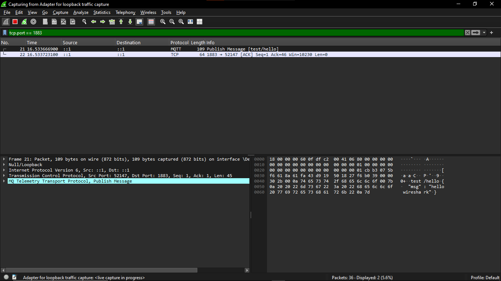
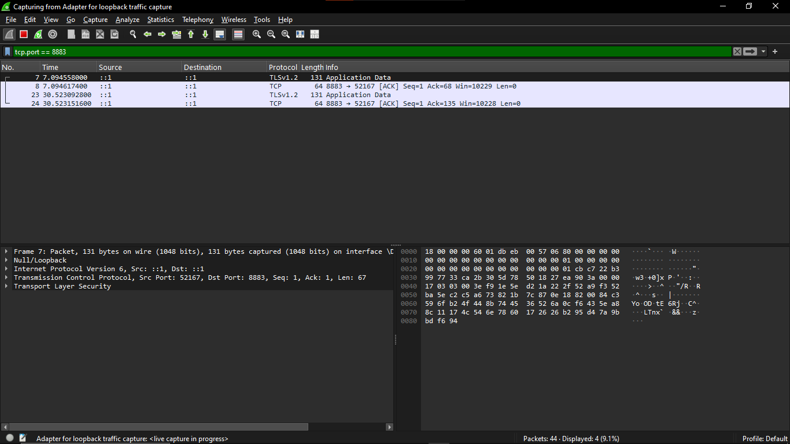

# MQTT Traffic Analysis: Plaintext (1883) vs TLS (8883)

**Week 3, Day 8 — TLS for MQTT**

## Objective

Demonstrate the practical security difference between an unencrypted MQTT
listener and a TLS-secured one on the same broker, using packet capture as
evidence.

## Setup

- **Broker:** Mosquitto 2.1.2, running locally on Windows with two parallel
  listeners:
  - `1883` — username/password authentication, no encryption
  - `8883` — TLS (self-signed CA, server cert CN=`localhost`), same
    username/password authentication layered on top
- **Client:** MQTTX, connecting via `localhost`
- **Capture:** Wireshark, using the Npcap "Adapter for loopback traffic
  capture" (required since Windows does not route `127.0.0.1` traffic
  through a standard network adapter)
- **Filter:** `tcp.port == 1883 or tcp.port == 8883`

## Method

1. Started Mosquitto with both listeners active.
2. Started a Wireshark capture on the loopback adapter before connecting
   any clients, to capture full handshakes.
3. Connected via MQTTX on `1883`, published a test message to topic
   `test/hello`, subscribed, and received it.
4. Repeated the same publish/subscribe test via MQTTX on `8883` (TLS).
5. Stopped the capture and inspected both streams.

## Results

### Port 1883 (no TLS)

Wireshark identifies the traffic directly as the `MQTT` protocol. Inspecting
the packet bytes shows the full MQTT PUBLISH message in plain ASCII,
including the topic name and payload:

```
Topic: test/hello
Payload: {"msg" : "hello wireshark"}
```

No decryption or special tooling was needed — the payload is readable
directly in the packet bytes pane. The same applies to the CONNECT packet
earlier in the stream, which carries the username and password used for
authentication in plaintext.



### Port 8883 (TLS)

Wireshark identifies the traffic as `TLSv1.2`, labeled `Application Data`.
The packet bytes show no recognizable structure — no topic, no payload, no
credentials. What passed over the wire after the handshake is opaque
ciphertext to any observer without the session key.



## Why this matters

MQTT was originally designed as a lightweight pub/sub protocol without
encryption built in, on the assumption it would run on trusted networks.
In practice, IoT devices are frequently deployed on networks that are not
fully trusted (shared Wi-Fi, cloud-hosted brokers, multi-tenant
infrastructure). Running MQTT on 1883 without TLS means:

- Any party with access to the network path (or, as shown here, even to
  the local loopback interface) can read message content and topics.
- Broker credentials sent at CONNECT time are exposed in plaintext,
  allowing credential theft even where authentication is otherwise
  correctly configured.

Layering TLS (port 8883) closes this specific gap: transport content and
credentials are encrypted end-to-end between client and broker, leaving an
observer with only metadata (packet timing/size) and no visibility into
the actual MQTT traffic.

## Next steps

- Mutual TLS (mTLS): require client-side certificates in addition to
  server-side TLS, so the broker authenticates the client's identity
  cryptographically rather than relying solely on username/password.
